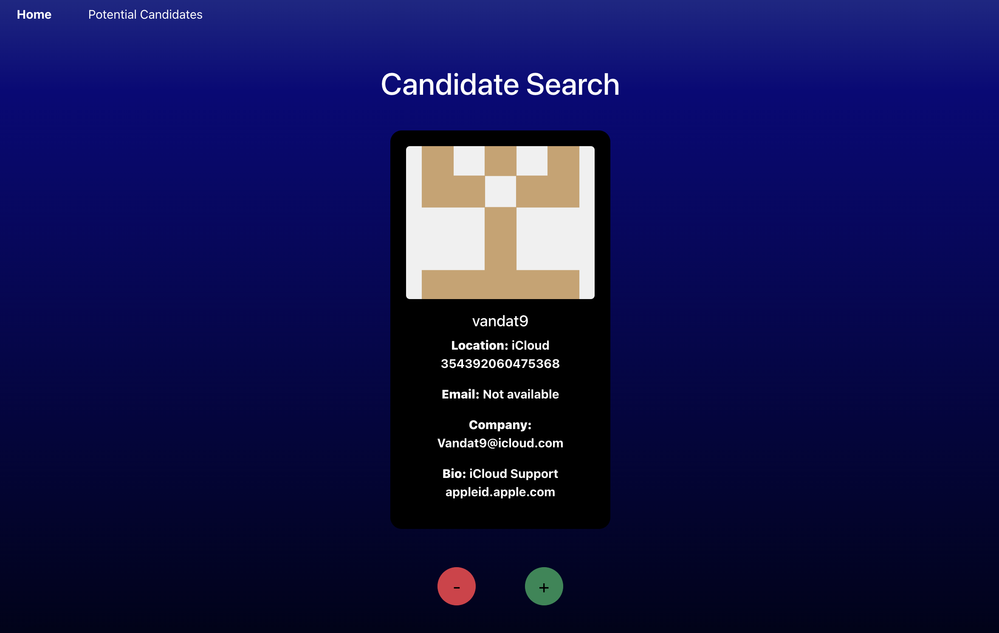
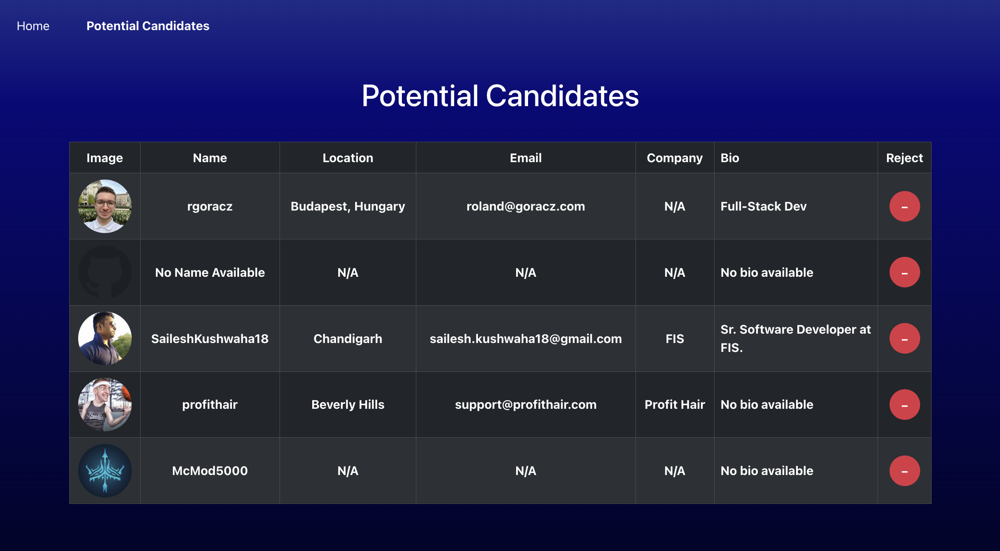

# Candidate Search Application
This is a Candidate Search application that allows users to search for candidates through the GitHub API and view their details directly in the browser. Users can interact with the candidate profiles by either approving or rejecting them. Approved candidates are saved as potential candidates, which can be reviewed later, displaying their information such as username, location, email, company, and more. 

You can click to view the live site [here](https://candidate-search-l1g1.onrender.com/) on Render. 





## Table of Contents
* [Features](#features) 
* [Installation](#installation)
* [Usage](#usage)
* [License](#license)
* [Contributing](#contributing)
* [Contact Information](#contact-information)

## Features
#### Candidate Search
* On the Home page (Candidate Search) users of the application can search for GitHub users (candidates).
* Candidate information is displayed such as image, username, location, email, company and bio. 
* Users of the app can save candidates to a list (stored in localStorage) or reject candidates (to move to the next candidate without saving).
#### Potential Candidates
* On the Potential Candidates page users of the application can see a list of saved candidates from their candidate search. 
* List of saved potential candidates are stored in a table with the ability to see the candidate information. 
* Users of the app can reject a saved candidate, removing them from the table.
* When there are no more candidates to review, a message is displayed to inform the user to search and save more candidates.
#### State Management and Local Storage
* LocalStorage is used to save and store candidate selection.
* Saved candidates are available after reloading the page.
#### GitHub API Integration
* This app will call the GitHub API to fetch candidate details.

## Installation
For this app you will need to 
1. Fork the repo to your local machine
2. Create a GitHub Personal Access Token
You'll need a [GitHub Personal Access Token](https://docs.github.com/en/authentication/keeping-your-account-and-data-secure/managing-your-personal-access-tokens#creating-a-fine-grained-personal-access-token) to access the GitHub API.
3. Create a .env file in the root directory and add your GitHub token
```
VITE_GITHUB_TOKEN=your_personal_access_token_here
```
4. Install the necessary dependencies using: 
```
npm install
```
5. Run the application:
```
npm start
```

## Usage
This app streamlines the process of discovering and managing potential candidates based on data fetched from GitHub, offering a simple and effective interface for evaluating and saving candidate profiles.

## License
This project is licensed under the ISC license.

## Contributing
Contributions welcome for this project! Feel free to fork the repository, make your changes, and submit a pull request.

## Contact Information
* GitHub: celeste-hayes